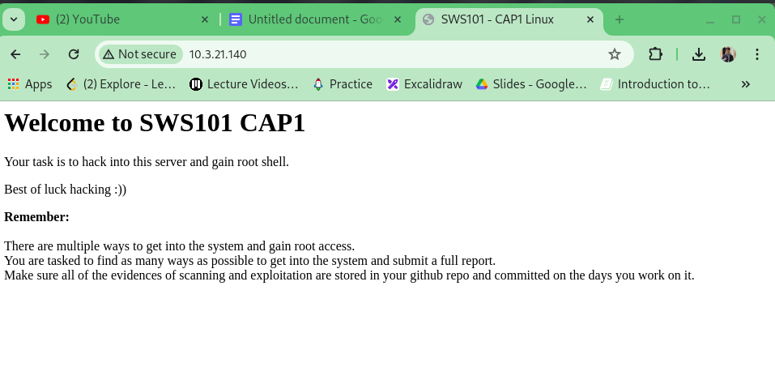
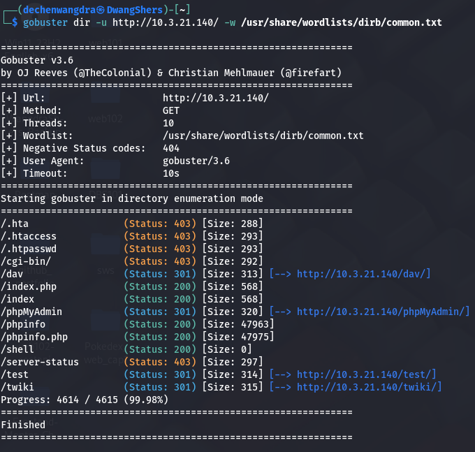

Hello viewer, in this article I will be hacking into the Ip address 10.3.21.140. This Ip address was provided by our tutor by making it vulnerable.  

Firstly, it is important that we are under the same local network to hack this machine. In my case I have to be in the college local network to penetrate into the targeted Ip address.

To find whether we are under the same network as the vulnerable machine, we should browse and it should reflect similar to mine. 

Now, let’s scan to check the open ports. 

Here, I am using the (-F) flag to nmap faster without taking much time. I can see that there are two open ports. Port 22 for ssh(secure shell) and port 80 for http(hypertext transfer protocol)

Then I did the version scan for particular ports. 

 Now, from port 22(ssh) I should try finding vulnerabilities like weak passwords, outdated software versions, or misconfigurations.

And from port 80(http) I could find vulnerabilities like cross-site scripting(XSS), SQL injection, and cross-site request forgery (CSRF).

Using the gobuster too, I could find the hidden directories of the server. In the directory phpMyAdmin, there was one login page.

If you are not able to find the path to common.txt file. Use (locate common.txt) to find its path.

We can either use ffuf to find hidden directories. 

