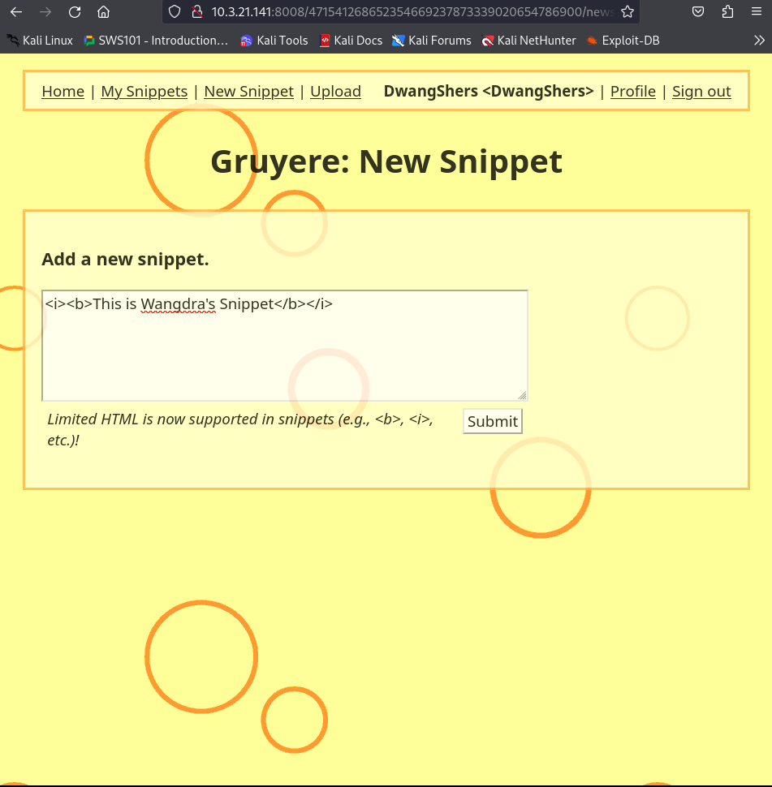

1. Broken Access Control (A01:2021).
   Previously number 5 on the list, broken access control—a weakness that allows an attacker to gain access to user accounts—moved to number 1 for 2021. The attacker in this context can function as a user or as an administrator in the system.

Example: An application allows a primary key to be changed, and when this key is changed to another user’s record, that user’s account can be viewed or modified.
Solution: An interactive application security testing (IAST) solution, such as Seeker®, can help you effortlessly detect cross-site request forgery or insecure storage of your sensitive data. It also pinpoints any bad or missing logic being used to handle JSON Web Tokens. Penetration testing can serve as a manual supplement to IAST activities, helping to detect unintended access controls. Changes in architecture and design may be warranted to create trust boundaries for data access.

2. Cryptographic Failures (A02:2021).
   Previously in position number 3 and formerly known as sensitive data exposure, this entry was renamed as cryptographic failures to accurately portray it as a root cause, rather than a symptom. Cryptographic failures occur when important stored or transmitted data (such as a social security number) is compromised.
   Example: A financial institution fails to adequately protect its sensitive data and becomes an easy target for credit card fraud and identity theft.
   Solution: Seeker’s checkers can scan for both inadequate encryption strength and weak or hardcoded cryptographic keys, and then identify any broken or risky cryptographic algorithms. The Black Duck® cryptography module surfaces the cryptographic methods used in open source software (OSS) so they can be further evaluated for strength. Both Coverity® static application security testing (SAST) and Black Duck software composition analysis (SCA) have checkers that can provide a “point in time” snapshot at the code and component levels. However, supplementing with IAST is critical for providing continuous monitoring and verification to ensure that sensitive data isn’t leaked during integrated testing with other internal and external software components.

3. Injection (A03:2021).
   Injection moves down from number 1 to number 3, and cross-site scripting is now considered part of this category. Essentially, a code injection occurs when invalid data is sent by an attacker into a web application in order to make the application do something it was not designed to do.
   Example: An application uses untrusted data when constructing a vulnerable SQL call.
   Solution: Including SAST and IAST tools in your continuous integration / continuous delivery (CI/CD) pipeline helps identify injection flaws both at the static code level and dynamically during application runtime testing. Modern application security testing (AST) tools such as Seeker can help secure the software application during the various test stages and check for a variety of injection attacks (in addition to SQL injections). For example, it can identify NoSQL injections, command injections, LDAP injections, template injections, and log injections. Seeker is the first tool to provide a new, dedicated checker designed to specifically detect Log4Shell vulnerabilities, determine how Log4J is configured, test how it actually behaves, and validate (or invalidate) those findings with its patented Active Verification engine.

4. Insecure Design (A04:2021).
   Insecure design is a new category for 2021 that focuses on risks related to design flaws. As organizations continue to “shift left,” threat modeling, secure design patterns and principles, and reference architectures are not enough.
   Example: A movie theater chain that allows group booking discounts requires a deposit for groups of more than 15 people. Attackers threat model this flow to see if they can book hundreds of seats across various theaters in the chain, thereby causing thousands of dollars in lost income.
   Solution: Seeker IAST detects vulnerabilities and exposes all the inbound and outbound API, services, and function calls in highly complex web, cloud, and microservices-based applications. By providing a visual map of the data flow and endpoints involved, any weaknesses in the design of the app design are made clear, aiding in pen testing and threat modeling efforts.

5. Security Misconfiguration (A05:2021).
   The former external entities category is now part of this risk category, which moves up from the number 6 spot. Security misconfigurations are design or configuration weaknesses that result from a configuration error or shortcoming.
   Example: A default account and its original password are still enabled, making the system vulnerable to exploit.
   Solution: Solutions like Coverity SAST include a checker that identifies the information exposure available through an error message. Dynamic tools like Seeker IAST can detect information disclosure and inappropriate HTTP header configurations during application runtime testing.

6. Vulnerable and Outdated Components (A06:2021).
   This category moves up from number 9 and relates to components that pose both known and potential security risks, rather than just the former. Components with known vulnerabilities, such as CVEs, should be identified and patched, whereas stale or malicious components should be evaluated for viability and the risk they may introduce.
   Example: Due to the volume of components used in development, a development team might not know or understand all the components used in their application, and some of those components might be out-of-date and therefore vulnerable to attack.
   Solution: Software composition analysis (SCA) tools like Black Duck can be used alongside static analysis and IAST to identify and detect outdated and insecure components in an application. IAST and SCA work well together, providing insight into how vulnerable or outdated components are actually being used. Seeker IAST and Black Duck SCA together go beyond identifying a vulnerable component, uncovering details like whether that component is currently loaded by an application under test. Additionally, metrics such as developer activity, contributor reputation, and version history can give users an idea of the potential risk that a stale or malicious component may pose.

7. Identification and Authentication Failures (A07:2021).
   Previously known as broken authentication, this entry has moved down from number 2 and now includes CWEs related to identification failures. Specifically, functions related to authentication and session management, when implemented incorrectly, allow attackers to compromise passwords, keywords, and sessions, which can lead to stolen user identity and more.
   Example: A web application allows the use of weak or easy-to-guess passwords (i.e., “password1”).
   Solution: Multifactor authentication can help reduce the risk of compromised accounts, and automated static analysis is highly useful in finding such flaws, while manual static analysis can add strength when evaluating custom authentication schemes. Coverity SAST includes a checker that specifically identifies broken authentication vulnerabilities. Seeker IAST can detect hardcoded passwords and credentials, as well improper authentication or missing critical steps in authentication.

8. Software and Data Integrity Failures (A08:2021).
   This is a new category for 2021 that focuses on software updates, critical data, and CI/CD pipelines used without verifying integrity. Also now included in this entry, insecure deserialization is a deserialization flaw that allows an attacker to remotely execute code in the system.
   Example: An application deserializes attacker-supplied hostile objects, opening itself to vulnerability.
   Solution: Application security tools help detect deserialization flaws, and penetration testing can validate the problem. Seeker IAST can also check for unsafe deserialization and help detect insecure redirects or any tampering with token access algorithms.

9. Security Logging and Monitoring Failures (A09:2021).
   Formerly known as insufficient logging and monitoring, this entry has moved up from number 10 and has been expanded to include more types of failures. Logging and monitoring are activities that should be performed on a website frequently—failure to do so leaves a site vulnerable to more severe compromising activities.
   Example: Events that can be audited, like logins, failed logins, and other important activities, are not logged, leading to a vulnerable application.
   Solution: After performing penetration testing, developers can study test logs to identify possible shortcomings and vulnerabilities. Coverity SAST and Seeker IAST can help identify unlogged security exceptions.

10. Server-Side Request Forgery (A10:2021).
    A new category this year, a server-side request forgery (SSRF) can happen when a web application fetches a remote resource without validating the user-supplied URL. This allows an attacker to make the application send a crafted request to an unexpected destination, even when the system is protected by a firewall, VPN, or additional network access control list. The severity and incidence of SSRF attacks are increasing due to cloud services and the increased complexity of architectures.
    Example: If a network architecture is unsegmented, attackers can use connection results or elapsed time to connect or reject SSRF payload connections to map out internal networks and determine if ports are open or closed on internal servers.
    Solution: Seeker is one of the modern AST tools that can track, monitor, and detect SSRF without the need for additional scanning and triaging. Due to its advanced instrumentation and agent-based technology, Seeker can pick up any potential exploits from SSRF as well.

### Features and Technologies

Gruyere includes a number of special features and technologies which add attack surface. We'll highlight them here so you'll be aware of them as you try to attack it. Each of these introduces new vulnerabilities.

- HTML in Snippets: Users can include a limited subset of HTML in their snippets.
- File upload: Users can upload files to the server, e.g., to include pictures in their snippets.
- Web administration: System administrators can manage the system using a web interface.
- New accounts: Users can create their own accounts.
- Template language: Gruyere Template Language(GTL) is a new language that makes writing web pages easy as the templates connect directly to the database. Documentation for GTL can be found in gruyere/gtl.py.
- AJAX: Gruyere uses AJAX to implement refresh on the home and snippets page. You should ignore the AJAX parts of Gruyere except for the challenges that specifically tell you to focus on AJAX.
  - In a real application, refresh would probably happen automatically, but in Gruyere we've made it manual so that you can be in complete control while you are working with it. When you click the refresh link, Gruyere fetches feed.gtl which contains refresh data for the current page and then client-side script uses the browser DOM API (Document Object Model) to insert the new snippets into the page. Since AJAX runs code on the client side, this script is visible to attackers who do not have access to your source code.

### Inside the SingUp.

When inspected, the signUp form is found to be GET, but normally it is expected to be a POST request. So this is one functional bug.

#This information I got it from chatGTP

1. Data Submission Semantics:

- POST: The POST method is designed to send data to the server to create/update a resource. This makes it suitable for sign-up forms where the user's information (like username, password, email) needs to be sent to the server for processing and storing in a database.
- GET: The GET method is intended for retrieving data from the server. It should not be used for actions that change the state of the server, such as creating a new user account.

2. Data in URL:

- POST: Data sent via a POST request is included in the body of the request, not in the URL. This makes it more suitable for sensitive information, such as passwords, because it is not exposed in the URL.
- GET: Data sent via a GET request is appended to the URL as query parameters, which can be easily logged in browser history, server logs, and other places where URLs are stored, leading to potential security risks.

3. Security:

- POST: Since the data is not exposed in the URL, it is less likely to be intercepted or logged in places where URLs might be stored, enhancing security especially for sensitive information.
- GET: Since the data is exposed in the URL, it is more vulnerable to being seen by unauthorized parties.

For these reasons, POST requests are the standard method for submitting form data, especially for actions that change server state or involve sensitive information, such as signing up a new user.

The issue described, where a sign-up form uses a GET request instead of a POST request, falls under several categories of the OWASP Top 10, primarily focusing on Security Misconfiguration (A05:2021) and Cryptographic Failures (A02:2021), with potential implications for Sensitive Data Exposure.

1. Security Misconfiguration (A05:2021)

Security Misconfiguration is a broad category that includes any configuration weaknesses that may compromise an application’s security. Using a GET request for form submission is considered a security misconfiguration because:

- Exposure of Sensitive Data: GET requests append data to the URL, making it visible in browser history, server logs, and other locations where URLs are stored. This can expose sensitive user information such as usernames and passwords.
- Inappropriate HTTP Method Use: GET should be used for retrieving data, not for submitting sensitive information. Using GET instead of POST is a misconfiguration of the intended use of HTTP methods.

2. Cryptographic Failures (A02:2021)

While primarily focused on encryption-related issues, Cryptographic Failures also cover the protection of sensitive data. Using GET requests can lead to sensitive data exposure because:

- Inadequate Protection: Sensitive data (e.g., passwords, personal information) transmitted in URLs can be easily intercepted and read by unauthorized parties, leading to data exposure and potentially system compromise.

3. Sensitive Data Exposure (related to A02:2021)

Even though Sensitive Data Exposure is no longer a separate category in the 2021 OWASP Top 10 and is now considered under Cryptographic Failures, the concept is still relevant. Using GET for form submission exposes sensitive data, which aligns with the issues that were traditionally considered under Sensitive Data Exposure.

#### Example and Solution from OWASP Top 10 Perspective

- Example: An application that uses a GET request to submit sign-up form data exposes the user’s password in the URL, which could be logged in server logs, browser history, or intercepted by a third party.
- Solution: Configure the form to use a POST request instead of GET. This ensures that data is sent in the body of the request, not the URL, reducing the risk of exposing sensitive information. Implementing tools like Seeker IAST can help detect such misconfigurations during testing phases.

#### Summary

Using a GET request for a sign-up form submission is a security misconfiguration that exposes sensitive data. To adhere to secure design principles, POST requests should be used for form submissions, especially when dealing with sensitive information. This configuration reduces the risk of data exposure and aligns with best practices for handling sensitive user information securely.

### Cross-Site-Secipting or XSS and xover sleeper close

Cross-Site-Scripting (XSS) is a security vulnerability where an attacker can add malicious code (like HTML or Javascript) to a website.

Step1: Creating New Snippet inside the Gruyere

#Note: Limited HTML is now supported in snippets (e.g.,
&lt;b&gt;,
&lt;i&gt; etc.)!

### New

So, here I'm doing a reflected XSS attack, where by vulnerability occurs when the server insterts the attack in the response verbatim or incorrectly escaped or sanitized.

Here I will be inserting a alert message through a simple html.

Uploading the file.

